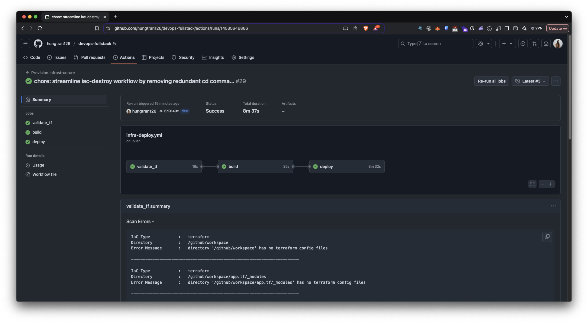

# devops-fullstack

**PROJECT STRUCTURE**

1. app.tf → Contains Terraform scripts for provisioning infrastructure.
2. .github/workflows → Contains CI/CD pipeline configuration.
3. report-resources → Contains the images for reporting.
4. other → coming soon

**CI/CD pineline**

1. Deploy an EKS Cluster using CI/CD for the main/dev environments.

1. Build and Deploy Back-End to Docker Hub
